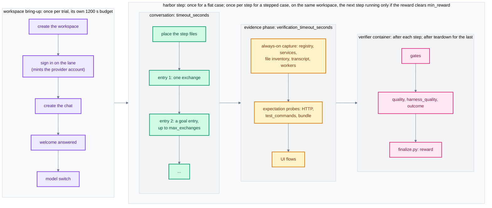
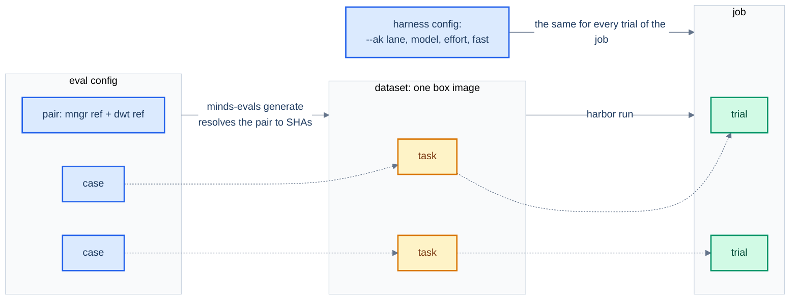
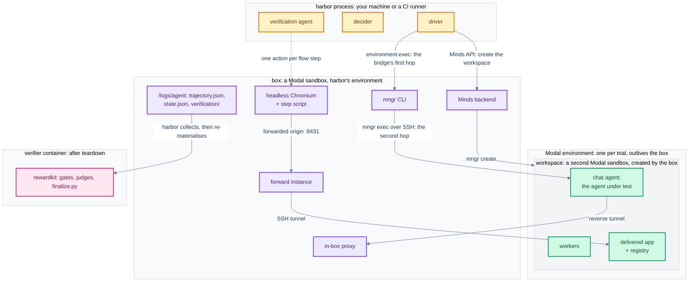
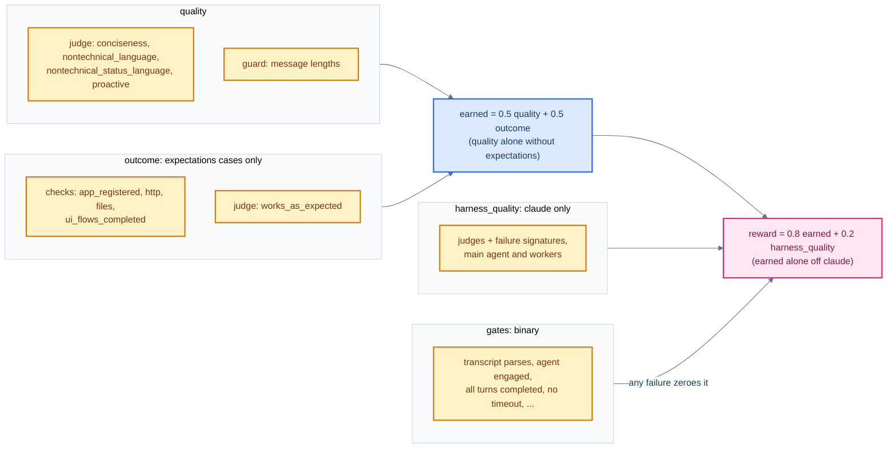
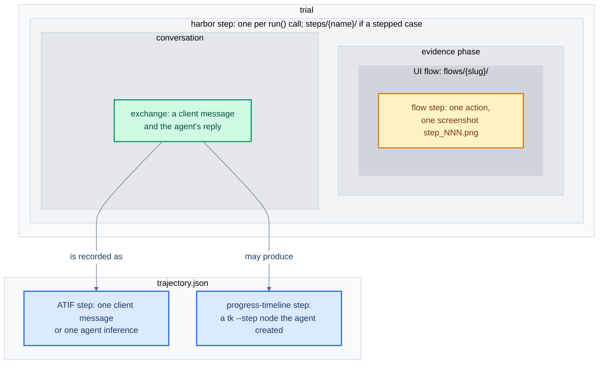

# Glossary

Terms used in minds-evals: in the [README](../README.md), the specs under `specs/minds-eval-harbor/`, and the code.
Each entry names the module, class or key that carries the term, so a word met in prose can be found in code.
Several everyday words (step, harness, verifier, check, gate, flow, run, agent, environment, outcome, state) mean more than one thing here; each entry says which sense it is, and the [last section](#words-with-more-than-one-meaning) lists the collisions in one place.
An entry ending in *Earmarked* names a term that is slated to change; do not build new names on it.

The diagram below places the main terms on a trial's timeline; the sections that follow define them.

## Harbor and rewardkit terms

Vocabulary we inherit from the framework, with what it maps to here.

- **harbor**: the eval framework this app is built on: it builds a task's environment, runs an agent against it, and grades the result with a verifier.
  Always invoked as `uv run --project apps/minds_evals harbor ...`.

- **rewardkit**: harbor's grading library, which runs inside the verifier container and scores criteria grouped into dimensions.

- **task**: one harbor task directory (`task.toml`, `instruction.md`, `tests/`, `solution/`, `environment/`, and `steps/` for a stepped case).
  Here, one case generates one task (`generate.write_task_dir`).

- **dataset**: a directory of tasks.
  `minds-evals generate` writes one from an eval config; every task in it shares a byte-identical `environment/`, so one dataset builds one box image.

- **job**: one `harbor run` over a dataset, named on the command line (`just minds-evals-run <dataset> <job> ...`).
  A directory under `jobs/` holding one trial directory per task attempt.

- **trial**: one execution of one task inside a job.
  Its directory holds harbor's `result.json`, the driver's output under `agent/`, and the verifier's under `verifier/`; its name is also the workspace's host name and part of the trial's Modal user id.

- **agent** (harbor agent): the thing harbor runs against the environment, which here is the driver.
  Hence `--ak` (agent kwargs) configures the driver, and `agent/` in a trial is the driver's output.

- **environment** (harbor environment): the sandbox harbor builds for a task, which here is the box.
  Code that takes a `BaseEnvironment` parameter is talking to the box.

- **multi-step task**: a task whose `task.toml` declares `[[steps]]`; harbor runs the agent once per step and verifies each.
  A stepped case generates one.

- **verifier**: harbor's grading container, which runs rewardkit over the recorded trajectory and evidence after the environment is gone.
  Its content is the task's `tests/` (`templates/tests/verifier/`); it is not the verification agent.

- **dimension**: a rewardkit criteria directory, scored to one number.
  Ours are `gates`, `quality`, `harness_quality` and `outcome` (`RewardDimension`); `reward` is the composed score, not a dimension.

- **criterion**: one scored item within a dimension: a programmatic `.py` check or a judge criterion.
  Every `.py` in a dimension directory averages into one programmatic reward; each `judge.toml` is a second reward with its own weight.

- **judge**: a rewardkit LLM judge scoring likert criteria from rendered inputs.
  Ours are the quality judge, the harness quality judges and the outcome judge (`works_as_expected`).

- **reward**: the trial's composed score on 0..1, written by `finalize.py`; see [Grading](#grading).

- **trajectory** (ATIF document): harbor's transcript format, `agent/trajectory.json`.
  The trial's only conversation record and the one every grade-time reader takes the conversation from; see [Expectations and evidence](#expectations-and-evidence) for how ours is built.

- **oracle**: harbor's canned solution to a task (`solution/solve.sh`, rendered by `generate.render_solve_script`).
  Ours writes a fabricated conversation and evidence bundle without booting Minds, so `harbor run -a oracle` exercises generation, the image build and grading for a fraction of a live run's cost.

- **regrade**: `harbor trial regrade` or `harbor job regrade`, which re-scores a recorded trial with today's verifier and no conversation re-run.
  Not available for multi-step tasks.

## Runs and arms

How our units map onto harbor's: an eval config's cases become a dataset's tasks, a job runs each task as a trial, and the harness config, chosen at run time, makes the arm together with the pair.

- **eval config** (`EvalConfig`, `configs/eval-config*.json`): the authored JSON file that pins a pair and lists the cases under `personas`.
  See [Eval config](../README.md#eval-config).

- **case** (persona case, `PersonaCase`): one entry of an eval config's `personas` list: an id, a persona, the `prompts` (or `steps`) the client sends, and optionally `expectations`.
  Generation turns each case into one task.

- **case config** (`CaseConfig`): the generated, machine-readable form of one case or one step, carried as the fenced JSON block in the task's `instruction.md` and as `tests/case.json`.
  The driver parses the former and the verifier reads the latter; they are written identically.

- **pair**: the mngr-internal ref and the default-workspace-template ref a dataset is generated from, resolved to SHAs at generation and recorded on every trial as `mngr_sha` and `dwt_sha`.
  *dwt* is default-workspace-template, the repository every workspace is created from.

- **arm** (`ArmRecord`): the whole treatment a trial ran under: the pair plus the harness config.
  Scores are comparable only within an arm; see [Harness and model arms](../README.md#harness-and-model-arms).

- **harness config** (`HarnessConfig`, `configs/harness_configs.json`): the run-level choice of lane, model, effort and speed tier the chat runs on, set with `--ak` kwargs.
  The *default harness config* is a lane and nothing else, the product exactly as it ships.

- **lane** (provider lane, `HarnessLane`): the pasted-key sign-in path the workspace offers for a provider: `anthropic`, `openai`, `api-key`, `openrouter` or `opencode-go`.
  The lane decides the agent harness, because that is how the product decides it.

- **harness** (agent harness): the coding agent the workspace's chat runs on: claude, codex or pi-coding.
  Read back from the workspace's own accounts listing (`AccountRecord.harness`), never assumed; not the *eval harness* below.

- **eval harness**: this project's own machinery: the driver, the collector, the verifier and everything else that measures rather than being measured.
  A manifest entry or flow status of `error` means the eval harness could not find out; `failed` means the workspace fell short.

- **catalog id**: a model id as the workspace's own picker spells it (`opus[1m]`, `anthropic/claude-haiku-4-5`, `gpt-5.6-sol`), which is what `--ak model=` takes.
  Not an API model name.

- **model switch** (`minds_bridge.switch_model_choice`): the single call that applies a harness config's model, effort and fast axes to the chat, made after the welcome has been answered and before turn 1.
  Recorded as `model_choice_switch`: `applied`, `skipped`, or the failure that stopped the trial.

- **observed models** (`ObservedHarnessModels`): the model names read off the transcript's agent steps after the client's first turn, and `welcome_model` for the greeting.
  `is_model_confirmed` is `true` when exactly one was observed and it is the requested one, and `null` (never `false`) whenever nothing could be read.

## Inside a trial

Where each part runs: the eval harness lives in the harbor process, the box is one Modal sandbox, the workspace is a second one that the box creates beside itself and that outlives it, and grading happens in a third container after each step and, for the last step, after teardown.
Nothing on the host reaches the workspace directly: every driver call is bridged into the box first and from there into the workspace.

- **box**: the harbor environment: a Modal sandbox running a full Minds computer, built from the box Dockerfile and mngr at the pair's SHA.
  Code calls it `environment` and prefixes its paths `BOX_` (`minds_bridge.py`); prose calls it the box.

- **driver** (`MindsPersonaDriver`, `driver.py`): the host-side harbor agent that prepares the workspace, drives the conversation, runs the evidence phase and tears down.
  One `run()` call per harbor step.

- **bridge** (`minds_bridge.py`): the exec plumbing from the driver into the box (`run_in_box`) and one level deeper into the workspace through `mngr exec` (`run_in_workspace`).

- **workspace** (nested workspace): the Minds workspace the box creates through the production path (Minds API, `mngr create`, Modal provider), from a per-case clone of the template with `system/vendor/mngr` overwritten by the mngr under test.
  A second Modal sandbox that the box creates beside itself, in the trial's Modal environment, and that outlives it; the agent under test lives here, and `workspace_agent_id` is its mngr agent id.

- **chat agent** (`chat_agent_id`): the workspace's first chat, created by the driver after sign-in.
  This is the agent under test; it receives the welcome and every client message.

- **provider account** (`AccountRecord`): the account the sign-in mints in the workspace.
  A chat binds to one when it is created, which is why sign-in has to precede chat creation.

- **welcome**: the `/welcome` greeting the template types into the workspace's first chat, answered on the workspace's default model since the switch comes after it.
  The driver waits for it to be answered before turn 1; the gates and the message-length check ignore it, while the judged transcript keeps it as the first agent message.

- **eval-case commit** (`driver.build_eval_case_commit_command`): the commit the driver makes, with fixed dates, in the per-case clone the workspace is created from, so the same tree always yields the same SHA.
  `deliverable.bundle` is `<that commit>..HEAD`, the agent's own commits.

- **forward instance** (`forward_instance.py`): the driver's own `mngr forward` process, which serves each delivered app at its forwarded origin (`https://<label>.agent-<hex>.localhost:8431/`) so UI flows reach the app through the product's serving path.

- **proxy** (in-box proxy, `proxy_config.py`, `resources/box_proxy_hooks.py`): a LiteLLM proxy the driver runs in the box under `--ak proxy=true` and signs the workspace in against.
  Its log (`agent/usage_proxy.jsonl`) is the complete account of the workspace's model calls, delegated ones included; `anthropic` lane only.

- **reverse tunnel** (`resources/box_reverse_tunnel.py`): the forwarding over mngr's SSH channel that exposes a box port (the proxy's) inside the workspace, so the proxy sits outside the agent's reach.

- **Modal environment** (`cleanup_environments.py`): the Modal environment mngr's provider creates for each trial's workspace sandboxes (`minds-staging-evals-...`).
  Deliberately left behind for post-mortems; not the box, and not the task's `environment/` directory.

- **user id** (`driver.derive_user_id`): the per-trial `MNGR__PROVIDERS__MODAL__USER_ID` scope, `evals-<prefix><trial>-<salt>`, which names the Modal environment.
  Nothing to do with the simulated user.

## The conversation

- **client**: the simulated non-technical user the agent talks to.
  Its messages are the trajectory's `user` steps; `decider.render_client_conversation` renders the conversation from its side.

- **persona**: the prose description of the client that the decider role-plays from.
  Also the eval config key that lists the cases, `personas`.

- **decider** (`decider.py`): the model (`-m/--model`, default `claude-opus-4-8`) that writes the client's messages for `DECIDE_FROM_PERSONA` turns and goal entries.
  Its spend is the eval harness's own, recorded as `decider_usage`.

- **entry** (prompts entry, `PromptEntry`): one item of a case's `prompts` list: a literal string sent verbatim, the `DECIDE_FROM_PERSONA` sentinel, or a goal entry.
  `state.json` records one `EntryRecord` per entry with its outcome: `completed`, `satisfied`, `budget_exhausted` or `fallback` (`TurnOutcome`).

- **goal entry** (`GoalEntry`, `GoalTurnSource`): `{"goal": ..., "max_exchanges": N}`: a client that keeps replying until it declares itself satisfied or the budget runs out, judging from the conversation alone.

- **exchange**: one client message and the agent reply it draws (`driver._run_exchange`).
  A literal or decided entry is one exchange; a goal entry is up to `max_exchanges` of them.

- **turn**: loosely, an exchange.
  In `state.json`, the legacy `num_turns` counts configured entries and `waits_done` counts messages actually sent; the two differ once a goal entry is involved.

- **turn source** (`TurnSource`, `LiteralTurnSource`, `PersonaLLMTurnSource`, `GoalTurnSource`): the driver's seam between the conversation loop and the model calls.
  A source only ever answers `Say` or `Done` (`TurnAction`) and never touches the workspace.

- **fallback** (`decider.FALLBACK_MESSAGE`): the literal `Sounds good.` the client sends when a decider call fails, so the trial completes instead of wedging.
  The entry's outcome is then `fallback`.

## Stepped cases

- **stepped case**: a case that declares `steps` instead of `prompts`.
  Generated as a multi-step task, run against one workspace, and verified after every step; see [Stepped cases](../README.md#stepped-cases).

- **harbor step** (step of a case, `CaseStep`, `StepPosition`): one named stretch of a stepped case, with its own prompts, files, expectations and optional `min_reward`.
  Harbor calls the driver's `run()` once per step and gives each its own `agent/` and verifier; this is the step in `steps/<name>/`, `Step: <name>` markers and `step_elapsed_seconds`.

- **step files** (uploads, `StepFile`, `upload_id`): the files a step "uploads" into the workspace's `data/uploads/<upload_id>/` before its first message, staged through the box.
  They do not exist in the workspace before that step.

- **min_reward** (`StepMinReward`): the reward floor a step must reach for harbor to run the later steps; below it harbor aborts the rest of the trial.
  Not allowed on the last step.

- **reward strategy** (`RewardStrategy`): how per-step rewards become the trial's: `final` (the last step's) or `mean`.

- **step boundary** (`StepBoundary`, `trajectory.py`): the cosmetic `system` step (`Step: <name>`) the driver inserts into a cumulative trajectory where each harbor step began.
  No grade-time reader scores it.

## Expectations and evidence

- **expectations** (`Expectations`, `expectations.py`): the optional block on a case or step that says what was commissioned: `outcome` prose for the judge, a `deliverable`, `ui_flows` and `test_commands`.
  The authored form is expanded once, at generation, into an explicit check list (`ExpandedExpectations`) written identically into the case config for the driver and the verifier; see [Outcome verification](../README.md#outcome-verification).

- **deliverable** (`DeliverableExpectation`): what the case commissions; the only kind is `minds-app`, which implies app, HTTP and bundle checks.
  Also names `deliverable.bundle`, the git bundle of the agent's commits.

- **check** (expectation check, `AppCheck`, `HttpCheck`, `FilesCheck`, `UiFlowCheck`): one expanded, probeable expectation, of class `app`, `http`, `files`, `bundle`, `test_command` or `ui_flows` (`CheckClass`).
  Each becomes manifest entries at trial time and feeds a criterion at grade time.

- **evidence phase** (evidence collection, `EvidenceCollector.collect`): the driver phase after the last turn, while the workspace is still alive, that records what was delivered into `agent/verification/`.
  Its budget is `verification_timeout_seconds`, which bounds this phase and not the verifier container.

- **evidence bundle** (`verification/`): the recorded evidence: the manifest, the app registry, service status, a file inventory, `repo_state.json`, `deliverable.bundle`, the common transcript, worker captures, HTTP probe bodies, flow logs and screenshots, and `trace.jsonl` (every bridge command the collector ran).
  See [Evidence, not live state](../README.md#evidence-not-live-state).

- **manifest** (`EvidenceManifest`, `ManifestEntry`): `verification/manifest.json`, the index of every probe with a typed status (`CheckStatus`).
  `failed` (the workspace fell short) and `error` (the eval harness could not find out) are different claims, and `error` entries are excluded from the criteria they would have fed.

- **registry** (`RegisteredApp`): the workspace's `data/.state/apps.toml`, where apps register their ports; a **registered app** is one row of it.

- **pre-existing / delivered** (`resolve_preexisting_registrations`, `resolve_delivered_apps`): the registry rows the workspace already served before turn 1, measured by a probe rather than a name list, versus the rows the agent added.
  Rows marked `internal` and abandoned isolated-instance previews are neither; if the registry could not be read the pre-existing set is unknown and the app checks record `error`.

- **trajectory source** (`TrajectorySource`, `metadata.trajectory_source`): which shape `trajectory.json` holds: `workspace` (the captured ATIF document, `trajectory.build_workspace_trajectory`), `hand_built` (the driver's own turn summary, kept current after every turn as the fallback) or `none`.
  Either shape carries an `extra.minds_evals` block (`TrajectoryProvenance`) naming the driver, the decider and its turns, the case, the usage source and the arm.

- **common transcript** (`TranscriptCapture`): mngr's own full-fidelity stream of the workspace agent (`mngr transcript`), captured as `verification/common_transcript.jsonl` and turned into the ATIF document.

- **worker** (worker agent, `WorkerLaunch`, `WorkerCapture`): a separate mngr agent the chat agent launched through the launch-task skill, discovered by `trajectory.scan_worker_launches`.
  Its transcript is captured and embedded under the launching call as a subagent trajectory, and its spend is summed into the transcript account.

## UI flows

- **UI flow** (flow, `UiFlow` authored, `UiFlowCheck` expanded): one natural-language walk through the delivered UI, declared under `expectations.ui_flows` as `actions` (what to do) and `expect` (the end condition).
  Trial time records whether the actions were carried out; only the grade-time judge rules on `expect`; see [UI flows](../README.md#ui-flows).

- **verification agent** (flow agent, `VerificationAgent`, `AnthropicVerificationAgent` in `ui_flows.py`): the host-side model, the decider's sibling, that reads the page and decides one action at a time while a flow runs.
  Set with `--ak verifier_model=`, its spend is `verifier_agent_usage` (`VerifierUsage`), and it is not the verifier.
  Earmarked: to become *flow agent* (`FlowAgent`, `--ak flow_agent_model=`, `flow_agent_usage`), freeing "verification" for harbor's grading sense.

- **action** (flow action, `FlowAction`, `FlowActionKind`): one decision the verification agent makes: `click`, `input`, `keys`, `scroll`, `open`, `reload`, `wait` or `done`.
  Addressed by ARIA role and accessible name, or by a snapshot ref (`[ref=e9]`) for a control with no name.

- **flow step** (`flow_runner.run_flow`, `step_index`): one iteration of the flow loop: one decision, one action performed by the step script, one screenshot (`step_NNN.png`) and one `log.jsonl` line.
  Capped at 15 per flow; not a harbor step.

- **step executor** (`FlowStepExecutor`): the seam that owns where the browser is while the flow loop owns what happens: the box-side executor in `evidence_collection.py` at trial time, `LocalFlowStepExecutor` in the flow lab.

- **step script** (`resources/box_flow_step.py`, protocol in `resources/flow_step_protocol.py`): the script run once per flow step, in the box or locally, which performs the action (`StepAction`), waits for the page to react, and reads the page back (`StepResult`) in a single exec.

- **reaction** (`StepReaction`): what the step script saw the DOM do after an action: `settled`, `none`, `still_changing`, or `unobserved` for the actions that do not watch.

- **page state** (`state_text`): the URL, title and ARIA tree the step script reads after an action, recorded verbatim in the flow log for the judge.
  Not `state.json`.

- **flow browser** (`flow_browser.py`): the headless Chromium launched once per flow, with its own profile and CDP port, so no flow inherits another's cookies or storage.

- **flow evidence** (`verification/flows/<slug>/`): the flow's `log.jsonl` and screenshots.
  The slug is the flow's `name`, slugified, and must be unique within the case.

- **flow reasons** (`REASON_*` in `ui_flows.py` and `evidence_collection.py`): the vocabulary that says why a flow ended.
  App-side reasons (`no_app_to_open`, `step_budget_exhausted`, `flow_deadline`, ...) make the flow `failed`; instrument reasons (`browser_launch_failed`, `tunnel_down`, `verifier_agent_failed`, ...) make it `error` (`is_instrument_reason`).

- **flow lab** (`flow_lab.py`, `minds-evals flow-lab`): drives one flow with the real step script and verification agent against a local static app in a local Chromium, with no box, workspace or proxy.
  `flow_lab_apps/` holds the apps it drives; `todo` is the fixture whose query string dials in page behaviours; see [The flow lab](../README.md#the-flow-lab).
  Earmarked: to become a plain `ui-flows` subcommand once UI flows are their own package.

## Grading

Our dimensions and how they compose; the verifier's content is `templates/tests/verifier/`.

How the dimensions compose into the reward:

- **gates** (structural gates, `gates/checks.py`): the binary criteria every trial must pass: the trajectory parses, the agent engaged, all turns completed, the run did not time out, and more.
  Any failure zeroes the reward.

- **quality** (`quality/`): how the agent talks to the client, on the chat and on the progress timeline, plus the programmatic message-length guard (`message_lengths.py`).

- **harness quality** (`harness_quality/`, `render_harness_report.py`): whether the workspace let the agent work at all (a skill that would not load, a missing plugin), counted as failure signatures.
  It scores the *agent* harness, on claude only; elsewhere the reward composition drops its share.

- **outcome** (dimension, `templates/outcome/`): what was delivered: one criterion per check class plus the outcome judge.
  Also the name of the prose the judge grades against, `expectations.outcome`.

- **reward composition** (`finalize.py`): zero unless every gate passed, otherwise the even split of quality and outcome with a fixed share to harness quality.
  See [Reward composition](../README.md#reward-composition).

- **error versus zero**: a trial the eval harness could not grade is recorded as an error with no reward (`finalize.py` deletes `reward.json`), never as a 0; a gate that ran and said no is a legitimate 0.
  See [Error versus zero](../README.md#error-versus-zero).

- **judge transcript / flows digest** (`render_judge_transcript.py`, `render_flow_evidence.py`): the renderings the judges read, rebuilt from the evidence on every grade: `judge_transcript.txt`, `judge_flows_digest.txt` with `judge_screenshots/`, and the harness reports.

- **progress timeline**: the `tk --step` progress nodes the client watches beside the chat.
  The second surface the quality judge grades, rendered as `[PROGRESS ...]` blocks in the judge transcript.

## Usage and cost

- **workspace agent** (`usage.py`, `agent/usage.json`): in usage records, the agent under test (the chat agent plus any captured workers), whose spend fills harbor's own token and cost fields.
  Four non-overlapping token buckets per model: uncached input, output, cache read, cache write; see [Token and cost accounting](../README.md#token-and-cost-accounting).

- **harness spend** (`DeciderUsage`, `VerifierUsage`): what the eval harness itself spent: `decider_usage` and `verifier_agent_usage`, reported as trial metadata and never folded into the agent's fields.
  Earmarked: to become *evals spend*.

- **usage source** (`UsageSource`): where the trial's resolved usage came from: `transcript` (the workspace's message feed plus captured workers) or `proxy` (the in-box proxy's complete log).

- **published spend** (`PublishedSpend`): the per-step delta the driver reports to harbor on a stepped case, so that cumulative records do not multiply the trial's total.

- **is_cost_complete**: whether all of the agent's traffic is in the total.
  `false` when delegated calls or uncaptured workers escaped the transcript account; a codex trial's `cost_usd` is `null` for a separate reason and keeps this `true`.

- **is_speed_observed / is_cost_rate_certain**: whether the speed tier of every request was seen (only the proxy can see it), and so whether the total is priced at the rate billed rather than as a standard-rate floor.

- **fast mode** (speed tier): the product's default for its claude chat: the same tokens at twice the rate.
  A harness config's `fast` axis.

## Scheduled CI

- **matrix** (`CiMatrix`, `ci_matrix.decide_matrix`): the nightly workflow's grid of arms: each evaluated pair times each selected harness config.
  See [Scheduled CI](../README.md#scheduled-ci).

- **cell** (`MatrixCell`): one arm of a scheduled run, one pair and one harness config, with its own job, concurrency group, artifacts and green marker.

- **main / released pair** (`FrozenPair`, `PairDecision`): mngr-internal and default-workspace-template both at `main`, or both at the `minds-v<version>` tag the stable channel names.
  A dispatch can name a `custom` pair instead.

- **pass** (`PassReport`, `ci_report.py`): one oracle run or one cell's live run, each with its own summary artifact and a column of the Slack grid.

- **green marker** (`ci_matrix.cache_key_for`): the `actions/cache` entry recording that an exact arm passed end to end, keyed on the pair's SHAs and the harness config.
  A green cell is skipped the next night.

- **nightly** (`HarnessConfigEntry.is_nightly`): a harness config whose flag is set, so a schedule runs it; the others run only when a dispatch names them.

- **check-run** (`check_run.py`, `RunCheck`, `TrialCheck`): `minds-evals check-run`, which decides whether a finished job passed: every trial completed, its gates held, nothing went unmeasured, and it ran on the model it asked for.
  Judge scores are reported, never gated; see [Checking a finished run](../README.md#checking-a-finished-run).

- **verdict** (`ArmVerdict`): how a pass or a pair reads in the report: passed, failed, skipped, not evaluated, or broken (no readable summary).

- **CI user id prefix** (`cleanup_environments.format_ci_user_id_prefix`): `ci-<YYYYMMDDtHHMMSSz>-`, stamped into every environment name a CI run creates so the backstop sweep can scope and age its deletions.

## Words with more than one meaning

Most of the collisions are on *step*; this is where each of the four lives.

- **step**: a *harbor step* of a stepped case; a *flow step* of a UI flow; an ATIF trajectory step (one inference); a `tk` progress-timeline step.
  Say which.

- **harness**: the *agent harness* (claude, codex, pi-coding) or the *eval harness* (this project).
  `harness_quality` and `harness config` are about the former; "the harness could not find out" is about the latter.

- **verifier / verification**: the *verifier* container grades; the *verification agent* drives UI flows at trial time; the *evidence phase* writes `verification/`; `verification_timeout_seconds` bounds the evidence phase, not the verifier.

- **check**: an *expectation check* (a probeable expectation); `check-run` (`check_run.py`, deciding whether a job passed); the verifier's `checks.py` files, which hold criteria; `check_run_in_box` in the bridge, which is unrelated to `check-run`.

- **gate**: the *structural gates* dimension and a step's `min_reward` floor, and nothing else.
  The README also says it of `check-run` and of the oracle pass; those are the run's *pass criteria* and a *precondition*, earmarked for rewording.

- **flow**: always a *UI flow*; the workspace's account sign-in flow (`sign_in_via_accounts_flow`) is the product's word and is always written *sign-in flow*.
  Earmarked: prose to say "UI flow" throughout; code takes the qualification from a `ui_flows` package rather than a prefix on every class.

- **run**: a job; a workflow run; one `run()` call of the driver, which is a harbor step; a flow run (`FlowRun`).

- **agent**: the driver (harbor's agent, hence `--ak` and `agent/`); the chat agent under test; a worker agent; the verification agent; `workspace_agent_id`, which is the workspace sandbox's mngr agent.

- **environment**: the box (harbor's environment); a Modal environment; the task's `environment/` build context; an env-var mapping (`box_env`).

- **outcome**: the outcome dimension; `expectations.outcome` prose; an entry's outcome in `state.json` (`TurnOutcome`); a flow step's result (`StepOutcome`).

- **state**: `state.json` and its `test_state`; a flow step's page state (`state_text`); a worker's or chat agent's lifecycle state (`WAITING`); `repo_state.json`.
