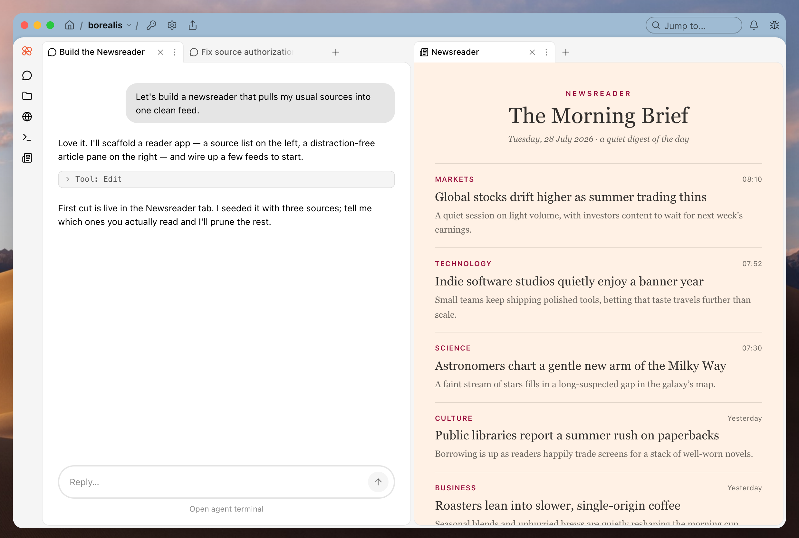
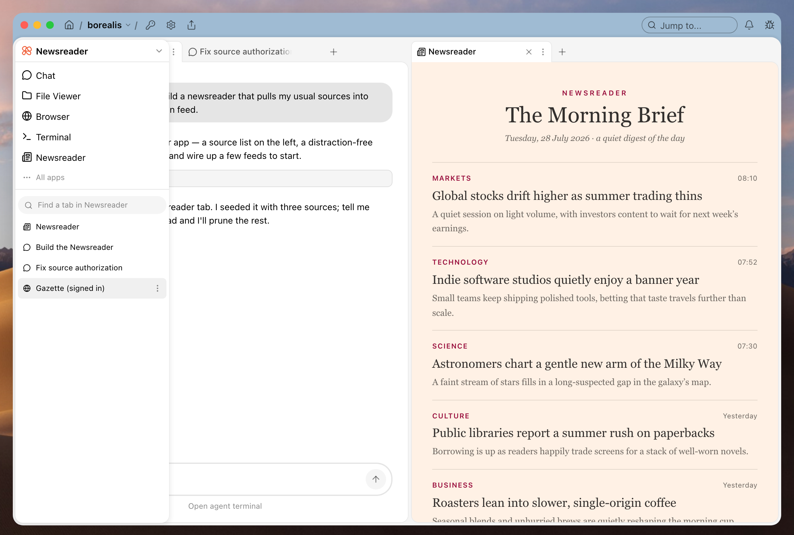
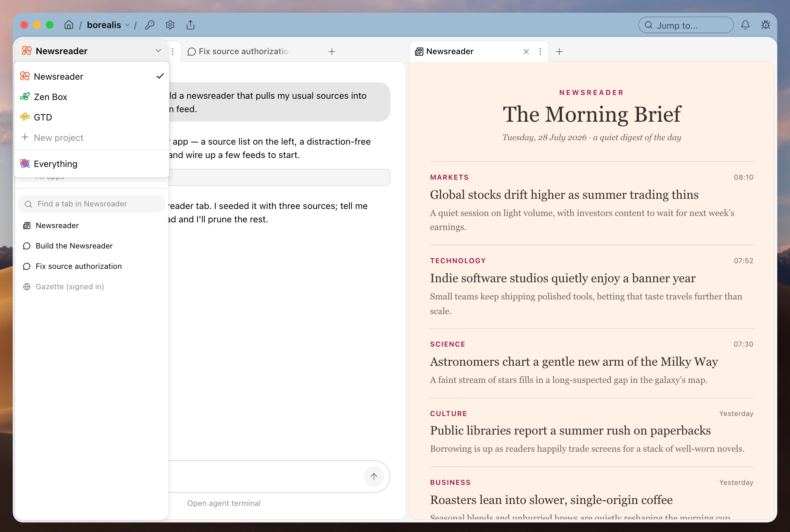
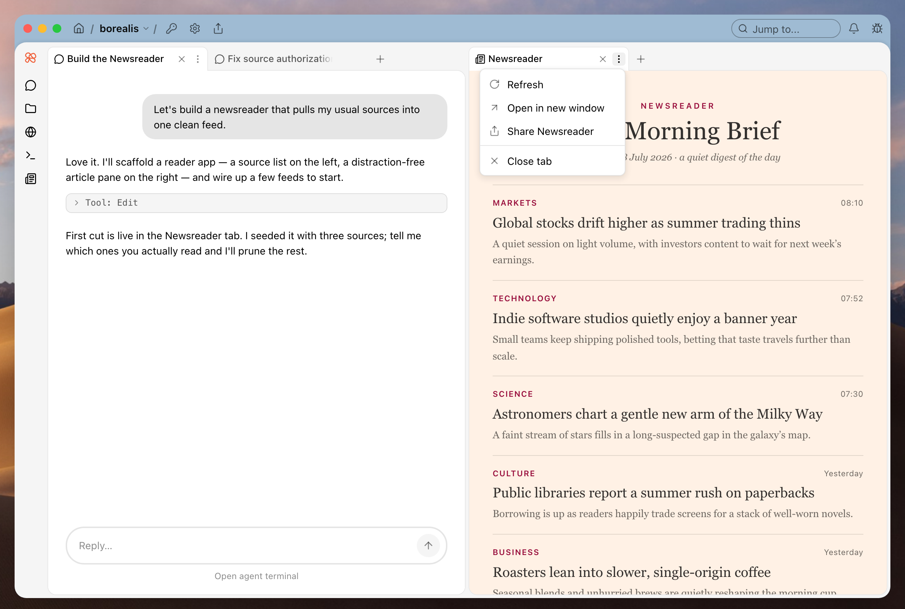
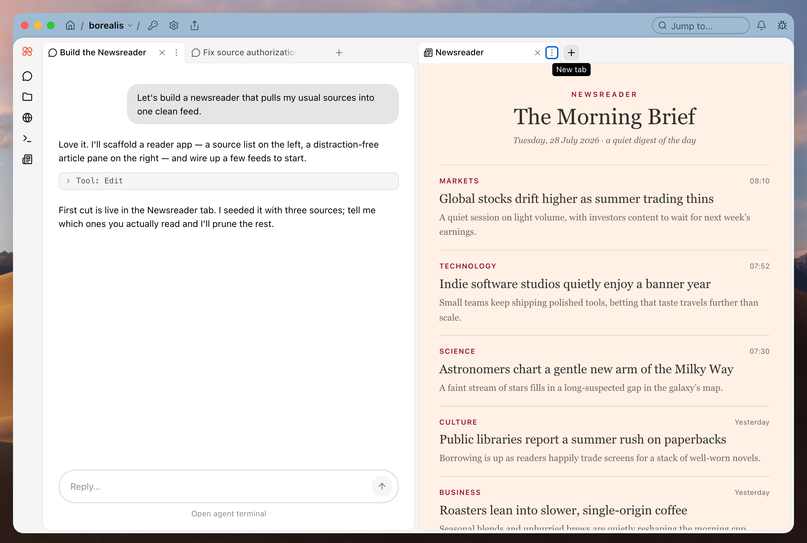
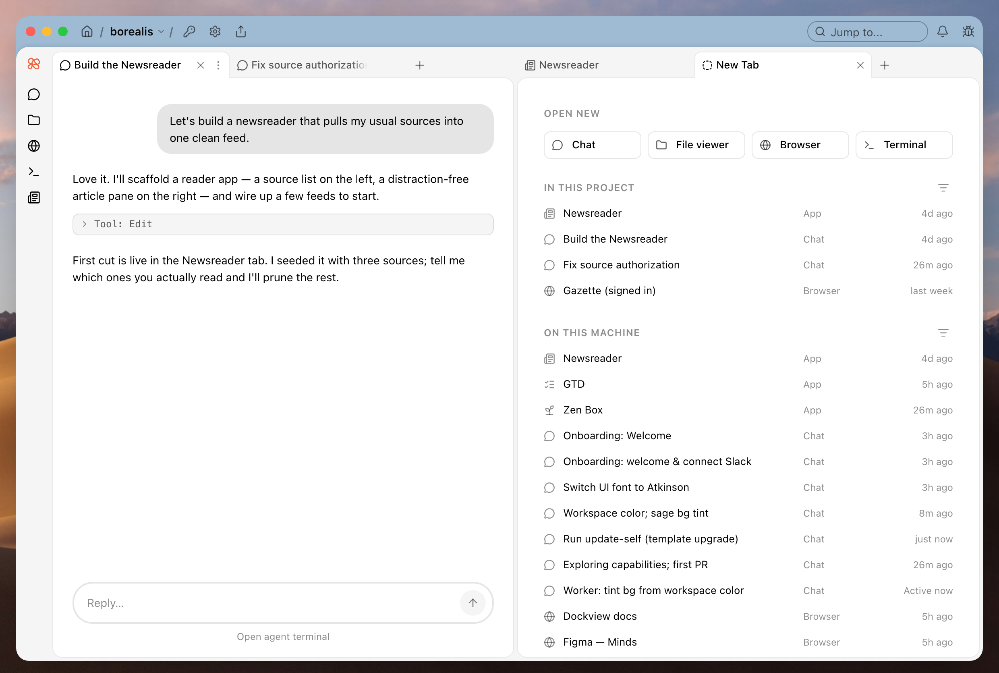
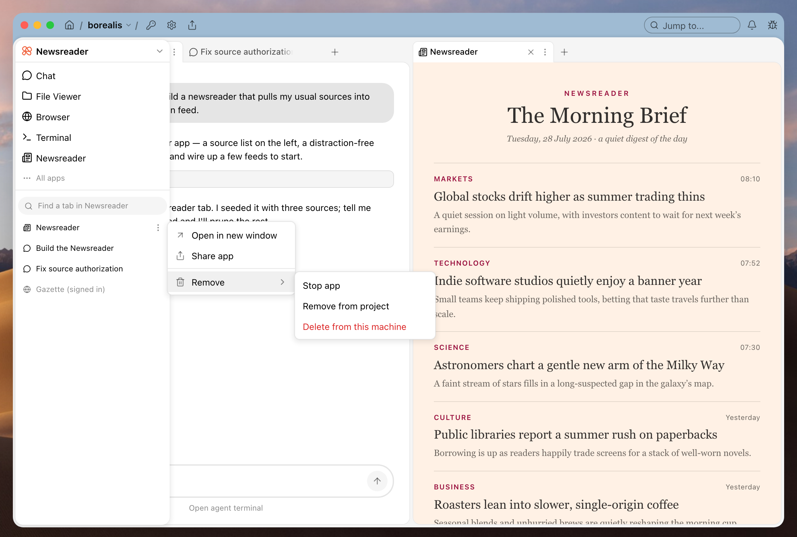

# Projects + docked tabs — implementation guide

This documents the settled design of the `minds-dockview` prototype so it can be
implemented in the real product. The prototype contains many toggles, layout
radios, and design levers; **those were exploration scaffolding**. Everything
below describes only the configuration the prototype boots into by default —
treat it as the one design, not one option among several.

Where things land, in production terms:

- **The inner workspace UI** (project sidebar, docked tabs, New Tab launcher,
  menus) is implemented in `~/imbue-ai/default-workspace-template`, in the
  `system_interface` app's frontend (the existing dockview workspace — see the
  reference map, §11).
- **The outer chrome** (Electron window, titlebar, machine switcher, Jump to,
  bell) is `~/imbue-ai/mngr-internal`'s minds shell and is **unchanged** by this
  design, except where noted (tooltips §8, "Open in new window" §9).
- The prototype is React + dockview-**react** v7; production is Mithril +
  dockview-**core** v5. Everything here is specified as behavior and design
  values, not prototype code; a reference map of the prototype sources (for
  cross-checking only) is at the end (§11). Two prototype mechanisms — the 4px
  inter-group gap (dockview's theme-level group gap) and some tab API
  affordances — should be checked against dockview-core v5 and may motivate a
  version bump.

---

## 1. The design at a glance

A machine opens onto its **active project**: a thin project rail on the left
(collapsed to 37px at rest) and a dockview dock filling the rest of the content
area. The dock holds this project's tabs, split into panes however the user
arranged them (here: a chats pane on the left, the project's app on the right).

Visual structure (the "connected tab card" treatment):

- The content surface behind the dock is a flat light grey
  (`rgb(245 245 245)` in light mode; dark mode TBD), inset 4px from the window
  frame on all sides.
- Each pane's **content panel is a white card** with a 1px
  `rgba(0 0 0 / 0.09)` hairline border and 12px corner radii.
- The **tab strip is transparent** (it sits directly on the grey surface). The
  **active tab is white and physically joined to its pane** — it shares the
  hairline outline on its top/left/right, the pane's top border tucks under it,
  and the junction is seamless, so the active tab + pane read as one
  browser-tab-shaped card. Inactive tabs are bare labels. The pane's top-left
  corner is square only when the first tab is active (the tab connects there);
  otherwise all top corners are 12px.
- Split separators are 4px of empty space showing the grey canvas between the
  cards.
- Workspace accent: the machine's accent colors the window chrome, the chat
  send button, and the focused-input outline — **not** the content surfaces or
  the tab strip (no accent wash).

## 2. Projects are two things at once

A **project** is the unit the design revolves around, and it must be modeled as
both of these together:

1. **A layout.** Each project owns its own dockview arrangement — the panes,
   splits, tab order, and active tab. Switching projects swaps the whole dock;
   switching back restores the project's layout exactly as it was, including
   live pane state (a project switch must not remount/reload the panels that
   come back — the prototype keeps per-project layouts in memory and only
   persists serialized state).
2. **A membership list of service ids.** Independent of what's currently open
   as a tab, a project durably links the things that belong to it, using the
   existing panel-ref grammar: `service:<name>`,
   `service:browser?session=<name>`, `chat:<agent-id>`, `terminal:<name>`,
   `url:<hash>`.

The second half is what makes projects more than saved layouts: **closing a tab
does not stop the underlying service.** Terminals keep their tmux sessions,
browsers keep running in the fleet, apps stay supervised. Today those
backgrounded things are only reachable by digging through the "+" menu. In this
design, every member of a project stays listed in the project's sidebar whether
or not it has a tab (§3, tab list) — that list *is* the management surface for
backgrounded services: reopen, open in a window, stop, remove.

Consequences for the data model (extending the workspace's existing
named-layouts store — see the reference map):

- Persist projects server-side the way named layouts are persisted today (one
  JSON per project + a registry with metadata), extending the saved-layout
  payload (dockview state + per-panel params) with the member-ref list, a
  stable project id, a display name, and an identity (glyph/color, §3).
  Autosave with the existing debounce; the members list changes only on
  explicit add/remove, not on tab open/close.
- Membership and layout are related but not identical: a member with no panel
  in the layout is a backgrounded/closed object; a panel must always correspond
  to a member.
- Chats map to mngr chat agents (one chat tab per agent). mngr agents already
  carry a `project` label that child agents inherit — chat membership should
  ride that, rather than a parallel bookkeeping mechanism.
- The prototype treats membership as a partition (every object belongs to
  exactly one project). Whether a singleton service (e.g. the machine's one
  custom app) may be a member of several projects is an open question (§10).

## 3. The project sidebar

The sidebar is a **collapsible hover rail**: at rest it is a 37px icon strip;
hovering expands it to a 240px panel that floats over the dock (150ms width
transition, labels fade in, overlay elevation shadow; it collapses again when
the pointer leaves, and stays open while one of its menus is open). Icons sit
in a fixed-width leading box so nothing shifts during the expand animation.

Top to bottom:

1. **Project switcher header** — the project's glyph + its name in bold + a
   caret; the whole header row is the click target (§4). Collapsed, only the
   glyph shows and it is the rail's identity for the project.
2. **Shortcuts** — one row per launchable kind, labeled with the bare name:
   *Chat, File Viewer, Browser, Terminal, ‹the project's app›*, then any apps
   the user pinned here. Icon + label, primary text. Click semantics follow the
   machine's multiplicity rules (§7): multi kinds create a new instance;
   singletons focus the existing instance or open it.
3. **"All apps"** — a quieter tertiary row opening a popover that lists this
   project's other apps first, then every other app on the machine (de-duped,
   this project's entries never repeat below). Each popover row opens the app
   on click and shows a **Pin** button on hover that adds it to this project's
   shortcut list. Shortcuts can conversely be unpinned; pin/unpin state is per
   project. Unpinned defaults reappear at the top of this popover so they can
   be re-pinned.
4. **Search** — a pill ("Find a tab in ‹project›") filtering the tab list
   below; matches on label and kind ("browser" keeps browsers), matched
   substrings render bold.
5. **The tab list** — every member of the project, open or not, icon + label:
   - **Open** (has a dock tab): primary text + icon.
   - **Backgrounded** (running or stopped, no tab): tertiary text + icon.
   - There is deliberately **no persistent selected-row highlight** — the dock
     shows several panes at once, so a single Slack-style selection would
     misread. Hover shows a transient fill.
   - Click focuses the existing tab, or opens the object into the active pane.
   - A kebab appears on hover with per-row actions (§6).

When collapsed, only the project glyph and the shortcut icons remain (no
search, no tab list, no All apps, no dividers).

**Project identity:** each project has a distinctive multicolor glyph and its
own color (examples in the reference map). Collapsed without a glyph
available, the rail falls back to a letter monogram on a tile painted in the
project's color, with the letter flipped black/white off that color's lightness
— the same self-theming contrast math the titlebar uses.

## 4. Project switcher, New project, Everything

The header opens a floating menu, sized to the header's width:

- One row per project — glyph + name, checkmark on the active one. Picking one
  saves the current project's layout and swaps the dock (§2).
- **New project** (quieter, tertiary) — creates an empty "Project N" and opens
  it on the **New Tab launcher** (§5), not on a pre-made blank chat, so the
  user picks what to start with.
- Below a divider, **Everything** — a lens, not a project. It looks and acts
  like a normal project (same header/shortcuts/search chrome) but its tab list
  is a flat concatenation of every project's members. It has no dock of its
  own: clicking a row switches the real dock to that object's owning project
  and opens it there. The shortcuts keep targeting the active real project.

## 5. The dock

Tabs are dockview panels; drag to reorder, drag to another pane, drag an edge
to split, drag out of the dock entirely to pop the tab into a window (§9).
Closing the last tab in the dock replaces it with a fresh **New Tab** launcher
tab — the dock never goes empty. (Today's workspace UI shows an empty-state
overlay when the dock empties; this design replaces that with the launcher.)

**Equal-width tabs.** Every tab in every pane renders at the same width: per
strip, ideal = (strip width − 44px reserved for the "+" and first-tab margin) /
tab count; take the **minimum across all strips**, clamp to [100px, 220px], and
apply that one width everywhere (recomputed on layout change, pane resize, and
window resize, coalesced to one recompute per frame).
Titles that overflow get a 20px trailing fade-to-transparent instead of an
ellipsis — but only when actually truncated; a short title stays crisp. Tab
title type: 13px / 500.

**Tab anatomy** — kind icon, title, then right-aligned **✕** (close) and **⋮**
(options), both revealed on hover. The blank New Tab launcher tab shows only ✕.

The tab **⋮ menu** (also the tab's right-click menu): *Refresh* (reload the
panel content), *Open in new window* (§9), for app tabs *Share ‹app name›*
(opens the machine's Share surface with that app pre-selected), then a divider
and *Close tab*. As with all context menus in this doc, the exact item set per
tab kind needs its own pass (§6).

**The "+"** sits after each pane's tabs and opens a New Tab launcher in *that*
pane (re-clicking it while the launcher is already open flashes the existing
launcher tab instead of duplicating). It shows a "New tab" tooltip on hover —
per §8, in production this is the standard minds tooltip:

**The New Tab launcher** is a full-page tab:

- **Open new** — a row of lean tiles: Chat, File viewer, Browser, Terminal
  (creation follows the multiplicity rules, §7).
- **In this project** — the active project's members (icon, label, kind,
  recency), so the launcher doubles as a jump-to surface.
- **On this machine** — everything else that exists machine-wide: registered
  apps, the browser/terminal fleets, other projects' members. Opening one from
  here opens it into this pane (and, if it belongs to another project, should
  raise the membership question — see §10).
- Each table has a per-table kind filter (funnel icon → checkboxes) and a
  recency column.

## 6. Context menus: per-type design required

**The prototype's menus are placeholders in both content and placement — do
not copy them literally.** The prototype shows one generic row menu everywhere:

*Open in new window*, *Share app* (app rows only), then *Remove ›* flying out
to *Stop app / Remove from project / Delete from this machine* (destructive,
red). That set is directionally right but **the real app must design each
menu per object type**, against the lifecycle verbs the backend actually has:

- **Terminal** — close tab (the terminal session keeps running) vs *Destroy*
  the session (the destroy action that exists in today's tab strip). "Stop
  app" and "Refresh" don't obviously apply.
- **Browser** — close tab vs close the fleet browser (frees one of the
  limited sessions). "Share" of a signed-in browser session is its own topic.
- **Custom app** — *Stop app* maps to stopping the supervised program;
  *Delete from this machine* means removing the app package itself — a
  heavyweight, confirm-gated action.
- **Chat** — a chat is an agent; "remove" semantics (archive the agent? just
  drop the tab?) need product definition; there is nothing to "stop".
- The same applies to the **shortcut rows'** context menus and the **tab ⋮
  menu** — decide the concrete item sets per kind during implementation, not
  from the prototype's screenshots.

Menu chrome itself is settled: floating cards (white primary surface, hairline
border, 8px corner radius, overlay elevation shadow, 32px rows of icon +
label, destructive items in red), anchored beside/below their trigger, flipped
near viewport edges, closed on outside pointerdown or Escape; opened by the
hover kebab and by right-click on the row.

## 7. Multiplicity: follow the template, defer the UI

The prototype has an "Allow multiple instances" toggle in shortcut menus.
**Do not build that UI now.** Multiplicity follows what the workspace template
already enforces, with no per-project configuration:

- **Custom app:** one open instance machine-wide (the existing
  one-pane-per-service dedup, keyed by service name). Its shortcut/tile
  focuses the open tab or opens the one instance.
- **Browsers:** multiple (the fleet, capped server-side — currently 3). The
  Browser shortcut/tile creates a new session; existing sessions are
  re-attached from the tab list / launcher.
- **Terminals:** multiple (named tmux sessions). Terminal shortcut/tile
  creates a fresh session; closed-but-alive sessions re-attach from the tab
  list / launcher.
- **Chats:** one tab per agent; "Chat" always creates a new chat agent (there
  is no cap on agents).

## 8. Tooltips

Inside the workspace, all tooltips (the dock "+", tab ✕/⋮, sidebar rows,
collapsed-rail icons) must use **the same tooltip as the mngr-internal shell —
styling and animation both** (the shell's `.minds-tooltip` bubble; see the
reference map):

- Look: inverse-surface bubble (near-black in light mode / near-white in dark,
  with the matching inverse text color), 12px helper type, 6px corner radius,
  8px horizontal / 4px vertical padding, overlay elevation shadow, max width
  400px, centered wrapping text.
- Behavior: shows after a **250ms** hover-intent delay (and on keyboard focus);
  **no fade — instant show/hide**; centered under the trigger with a 6px gap,
  flipping above when it would overflow the bottom, clamped 6px from viewport
  edges; hides on mouse-leave / blur / click / scroll / resize.

The workspace UI already has its own JS-positioned tab tooltip (built because
dockview marks tabs draggable, which suppresses native browser tooltips, and
the tab strip clips CSS-only bubbles) — keep that JS-positioned approach but
restyle and retime it to the spec above, or share the shell's tooltip trigger
script into the workspace the same way the embed-contract script is shared.
Replace every native browser tooltip inside the workspace with it. The
prototype's own tooltip chip (150ms delay + 100ms fade, no shadow) is
superseded by this — match mngr-internal, not the prototype.

## 9. Open in new window / tear-off

In the prototype, dragging a tab out of the dock (or *Open in new window*)
pops it into a movable, resizable in-page window styled as a mini macOS window
painted in the machine's chrome color, sharing one click-to-front z-order with
the app window. In production this collides with the current architecture
(the workspace lives in one sandboxed iframe; Electron enforces one OS window
per workspace), so the real mechanism — true OS windows via the embed
contract + Electron vs in-iframe floating windows — **needs an explicit
decision during implementation**. The gesture set to preserve: drag-out =
tear-off, row/tab menu "Open in new window", and the window's content is the
same panel the tab hosted (the underlying service keeps running either way).

## 10. Known gaps — decide during implementation

Things the prototype deliberately does not answer:

- **Renaming a project.** No rename UI exists anywhere in the prototype. It
  needs one (likely in the switcher header's context menu and/or a project
  settings surface), plus persistence rules: stable project id + editable
  display name (the named-layouts store already separates slug and display
  name — keep that split).
- **Deleting/archiving a project.** Also absent. Define what happens to a
  deleted project's running services (nothing should be silently killed).
- **Shared membership.** May one service id belong to several projects (the
  singleton custom app is the forcing case)? The prototype assumes a strict
  partition.
- **Project identity assignment.** Glyphs/colors are hand-seeded in the
  prototype; production needs auto-assignment on create (and possibly editing).
- **Migration.** What an existing machine (one global dock, named
  desktop/mobile layouts) looks like after upgrade — presumably a single
  starter project containing everything, with Everything easing the
  transition. Also define how projects interact with the mobile layout.
- **One-off chats.** Chats not tied to any project (quick side-chats) were
  explored in the prototype but nothing was kept in the default; where those
  live is unresolved.
- **New Tab cross-project opens.** Opening another project's member from "On
  this machine" — does it move, get shared, or just open a viewer? (§5, §10
  shared membership.)

## 11. Reference map (for cross-checking only)

Where each piece lands in the target repos, plus the prototype sources that
demonstrate the behavior. Code names here are pointers, not part of the spec.

| Piece | Where |
| --- | --- |
| Project data model + persistence (layout + member refs) | `default-workspace-template` — `system_interface` backend `workspace_layouts.py` (extend the named-layouts store), frontend `models/WorkspaceLayouts.ts` |
| Project sidebar (rail, switcher, shortcuts, All apps, search, tab list) | `system_interface` frontend — new view alongside `DockviewWorkspace.ts` |
| Per-project docks, switch/save/restore, dock-never-empty | `DockviewWorkspace.ts` |
| Equal-width tabs, connected tab-card CSS, grey canvas | `system_interface` `style.css` (port from prototype `src/styles/dockview.css`) |
| New Tab launcher (tiles + In this project / On this machine) | `system_interface` frontend (replaces the "+" dropdown + empty-state overlay) |
| Backgrounded-object listing (fleets, apps, agents) | `system_interface` `models/AgentManager.ts` (`browserFleet`, `terminalFleet`, `apps_updated`) |
| Chat↔project linkage | mngr agent `project` label (`mngr-internal` agent model + `system_interface` `agent_manager.py`) |
| Canonical tooltip (§8) | `mngr-internal` — `desktop_client/static/tooltip_triggers.js` + `.minds-tooltip` in `apps/minds/frontend/src/style.css`; workspace-side `system_interface` `views/hoverTooltip.ts` to restyle |
| Outer chrome (titlebar, switcher, Jump to, bell) | `mngr-internal` — unchanged |
| Open in new window / tear-off | joint: `embed_contract.js` + Electron (`mngr-internal`) + `system_interface`; mechanism TBD (§9) |
| Prototype reference — sidebar, dock, menus, launcher behavior | `prototypes/minds-dockview/src/screens/WorkspaceView.tsx`, `src/screens/NewTabView.tsx` |
| Prototype reference — tab-card, equal-tabs, canvas CSS | `prototypes/minds-dockview/src/styles/dockview.css`, `src/shell/ContentFrame.tsx` |
| Prototype reference — project glyph/monogram identity | `prototypes/minds-dockview/src/screens/projectGlyphs.tsx` |
