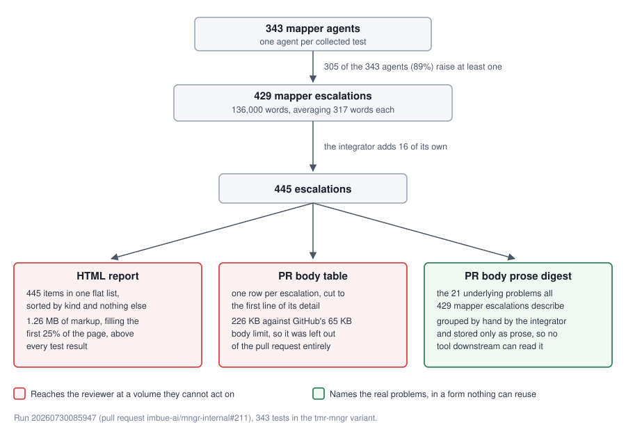

# TMR escalations: why run 20260730085947 was hard to review

Escalations are the channel a TMR agent uses to say "this needs attention beyond
my own test". The mechanism works: the run found real, systemic problems that no
single failing test pointed at. It produced 445 individual reports, of which the
429 raised by test agents describe 21 underlying problems, in a form that carries
no link to the code involved.

This document diagnoses the four issues raised about that run and proposes
changes. Terms used throughout: a **mapper** is one agent assigned one pytest
test; the **integrator** (also called the reducer) is the single agent that
merges every mapper's branch afterwards and sees the whole suite at once.

## The run in numbers

| Measure | Value |
| --- | ---: |
| Tests in the run, one mapper agent each | 343 |
| Escalations raised | 445 |
| ...from mappers / from the integrator | 429 / 16 |
| Mappers raising at least one | 305 of 343 (89%) |
| Kind `SHARED_PATTERN` (a local fix that siblings already carry) | 413 of 445 (93%) |
| Kind `BLOCKER` (something stopped the agent) | 32 of 445 (7%) |
| Distinct escalation titles | 444 of 445 |
| Underlying problems the 429 mapper escalations describe | 21 |
| Total escalation prose | 138,000 words, about 9 hours of reading |
| Mapper escalations from agents whose test passed with no changes | 201 of 429 (47%) |

Method: figures come from parsing the escalation block of the published HTML
report for this run; the 21-problem grouping is the integrator's own digest table
in the pull request body, whose per-problem counts sum to exactly 429.

## Where the escalations go



The integrator does the grouping work correctly and then writes the result into
the pull request as prose. Nothing stores it, so the report cannot render it and
a follow-up run cannot read it.

## Why the volume is so high

Three mechanisms compound.

1. **The trigger condition holds for most changes.**
   `libs/mngr_tmr/imbue/mngr_tmr/prompt_assets/mapper.j2:124-125` tells an agent
   to escalate when two or more sibling tests already carry the change it is
   about to make. Across 343 tests built on shared fixtures and idioms, that
   condition is satisfied by ordinary edits. It produced 413 of the 445
   escalations.

2. **The prompt removes any reason to be selective.**
   `libs/mngr_tmr/imbue/mngr_tmr/prompt_assets/mapper.j2:94-97` states that a
   clean pass "can and often should" raise an escalation and that escalating
   "costs you nothing and is never counted as a failure". 201 escalations came
   from agents whose test passed with no changes at all.

3. **Nothing merges duplicates downstream.** `_build_escalation_views`
   (`libs/mngr_tmr/imbue/mngr_tmr/report.py:694-728`) concatenates every agent's
   list and sorts it by kind. The 87 escalations reporting the ttyd install
   failure appear as 87 separate entries in the report.

The redundancy factor is roughly 20x: the integrator's digest maps all 429 mapper
escalations onto 21 groups, and one of those groups is a catch-all holding 13
one-off findings.

Text similarity cannot recover the grouping. 444 of the 445 titles are unique,
and grouping by shared title words splits the ttyd reports alone across four
separate clusters of 30, 14, 13 and 8. Only a reader who understands the
underlying problem can merge them, which is exactly what the integrator does.

## Why escalations are hard to trace to code

The record has no field for a code location. `Escalation`
(`libs/mngr_tmr/imbue/mngr_tmr/report.py:90-102`) carries three fields: `title`,
`detail_markdown`, and `kind`. The report adds a `source` column, which holds the
pytest node id of the test whose agent raised it — that identifies the reporter.
Where the fix belongs appears only inside free text, when it appears at all:

| Locator present, across all 445 escalations | Count |
| --- | ---: |
| Detail mentions any `.py` path | 431 |
| Detail cites a path with a line number | 242 |
| Title cites any path | 25 |
| Detail mentions the `FIXME(tmr)` marker the agent left in the tree | 24 |

Nothing in the report is linked.
`libs/mngr_tmr/imbue/mngr_tmr/report_assets/report.html.j2:66` renders the source
as plain `<code>` text, and the per-test tables carry no row anchors, so an
escalation cannot link even to the row of the test that raised it, let alone to
that agent's branch or diff.

The `FIXME(tmr)` comment
(`libs/mngr_tmr/imbue/mngr_tmr/prompt_assets/mapper.j2:108-113`) is the one
genuine code anchor in the design, and it is required only for `BLOCKER` — 32 of
the 445.

## Why the categories carry little information

The two kinds split on what happened to the reporting agent: `BLOCKER` means it
was stopped, `SHARED_PATTERN` means its fix worked but siblings already had it.
Neither answers what a reader should do, who owns the work, or how urgent it is.
With 93% of escalations in one bucket, the axis separates almost nothing.

That one bucket mixes three kinds of work with three different owners. Examples
from this run's digest, with the number of escalations each one drew:

| Kind of work | Examples from this run |
| --- | --- |
| Product defect in `mngr` | ttyd install short-circuits on every root host (87); `mngr exec --timeout` orphans the command it launched; `--start-on-boot` silently ignored |
| Test-harness defect | single-test runs exit non-zero on the 85% coverage gate (5); the session-end stale-container sweep is silently disabled and reports the wrong reason (16) |
| Suite duplication | `mngr list` hand-scoped to `--provider local` in ~48-60 places (14); `@pytest.mark.rsync` applied by rote (18) |

The first row holds user-visible product bugs that the suite discovered. Filing
them under the same label as a marker cleanup is what makes the categorization
read as messy.

Two smaller defects sit in the same area:

- A missing `kind` field parses as `BLOCKER`
  (`libs/mngr_tmr/imbue/mngr_tmr/report.py:354`, and the model default at
  `libs/mngr_tmr/imbue/mngr_tmr/report.py:100-102`), so malformed agent output
  silently lands in the most severe category.
- Sorting stops at kind (`libs/mngr_tmr/imbue/mngr_tmr/report.py:727`), so the
  413 shared patterns reach the reader in agent-name order.

## How escalations relate to unresolved agents

The two are orthogonal by design, and that design is sound. An escalation
describes the suite; a report section describes what the agent did to its own
test. `libs/mngr_tmr/imbue/mngr_tmr/report.py:105-124` and `:528-551` state this
explicitly, and `ChangeStatus` deliberately has no `BLOCKED` value
(`libs/mngr_tmr/imbue/mngr_tmr/report.py:56-68`) — it was removed so an
agent could report a successful fix and a systemic problem at the same time.

The run confirms the independence. Counts below cover the 429 mapper escalations;
the integrator's own 16 (5 of them blockers) belong to no section. No agent landed
in the Implementation fixes section this run.

| Section the raising agent landed in | Its escalations | of which `BLOCKER` |
| --- | ---: | ---: |
| Non-implementation fixes | 226 | 15 |
| Clean pass | 201 | 11 |
| Unresolved | 2 | 1 |
| Failed | 0 | 0 |
| **Total** | **429** | **27** |

Eleven blockers came from ten agents whose own test passed cleanly, and the six
agents that failed outright raised nothing at all. A reviewer reading only the
outcome sections would see a healthy run.

Two things do need fixing:

1. **"Unresolved" names two different things.** `ReportSection.UNRESOLVED` means
   "this agent could not land its change" — 1 agent in this run.
   `libs/mngr_tmr/imbue/mngr_tmr/prompt_assets/reducer.j2:245` uses "unresolved
   escalation" to mean "the integrator could not fix it suite-wide" — 445 items.
   Both appear in the reviewer's field of view.

2. **The pull request title disagrees with the report.**
   `libs/mngr_tmr/imbue/mngr_tmr/pr_summary.py:205` adds `UNRESOLVED` and
   `FAILED` together and labels the sum "unresolved", so the title reads "7
   unresolved" while the report and the pull request's own table say Unresolved
   1, Failed 6.

## The design, as built

Settled in review after this analysis, and implemented on this branch.

### Mapper outcome

`escalations` becomes `[{description_markdown, kind, locations}]`, with each
entry's id derived as `<agent_name>#<index>` rather than written by the agent, so
it is unique by construction.

- `title` and `detail_markdown` collapse into one `description_markdown`. Its
  first line must be a one-sentence summary, since every collapsed list view has
  to label the entry from it.
- `locations: [{path, line}]` gives the reader a jump into the code. It is
  display information, not a mechanical grouping key -- grouping stays a judgement
  the integrator makes.
- `kind` becomes required, with no default, over a vocabulary that names the work
  rather than what happened to the agent:

  | Kind | Means |
  | --- | --- |
  | `UNCAUGHT_BUG` | a real defect the agent noticed that no test fails on |
  | `FIX_DIRECTION_AMBIGUOUS` | test and behavior disagree, and the docstring does not settle which is right |
  | `HARNESS_DEFECT` | shared test infrastructure is broken, misreports, or lacks a capability or credential |
  | `SUITE_DUPLICATION` | N local patches want one shared change |

### Integrator outcome

`normalizations` and `escalations` merge into a single `escalations` array. A
normalization is a resolved escalation the integrator raised to itself, so it
needs no separate field.

```
escalations: [{
  kind,
  description_markdown,
  member_ids: [str],               # mapper escalations covered; may be empty
  resolved_in_commit_hash: str?,   # set <=> resolved
}]
```

Empty `member_ids` covers the integrator's own findings: three of its sixteen
escalations on #211 came from reading the integrated diff, and one — two agents
reaching opposite conclusions on `@pytest.mark.modal` — could not have come from
a mapper at all. An escalation the integrator judges to need no change carries no
commit hash and so reads as unresolved, with the reasoning in its description.

Coverage is enforced rather than requested: a new
`python -m imbue.mngr_tmr.escalation_coverage` module checks that every mapper
escalation is claimed by some group, run by the integrator before it publishes
and again by `report.py` at render time. It checks claiming, not equality -- a
`member_id` naming an escalation that does not exist passes -- and it cannot
judge whether a grouping is sound, which is why the report shows each group's
member count.

### HTML report

- The raw per-mapper escalations are always shown, whether or not the integrator
  has run. The report is regenerated on every poll, and mappers finish long before
  the integrator exists, so a grouped-only view would be empty for most of a run.
- The integrator's output gets its own leading "integration report" section
  holding the grouped escalations and the rest of what it produced.
- Escalation sections became real sections, with ids, counts, and left-nav
  entries. The escalations block used to carry no `id` while `_build_toc_links`
  built the sidebar from `sections` alone, so 445 items were reachable only by
  scrolling past them.
- Ordering: unresolved before resolved; within each, integrator-originated first
  (`member_ids` empty), then descending by member count, with stable input order
  as the tiebreaker. Integrator-originated ones lead because a plain member-count
  sort gives them count 0 and buries the findings no mapper could have seen.
- Section assignment is corrected: `IMPL_FIXES` is checked before the test-fix
  branch so implementation fixes stop landing under a test label;
  `NON_IMPL_FIXES` becomes `TEST_AND_DOC_FIXES`, matching the `[TEST/DOC]` commit
  the reducer already writes at
  `libs/mngr_tmr/imbue/mngr_tmr/prompt_assets/reducer.j2:83`; `UNRESOLVED` becomes
  `FIX_FAILED`, freeing the word for escalations; and the final fallthrough gets
  its own `INDETERMINATE` section instead of hiding inside `UNRESOLVED`.

### Pull request body

The report link moves to the top as `Full report: <url>`, dropped entirely when a
run has no uploaded report. Escalations split into unresolved, with full
descriptions, followed by resolved, with one line and a member count each. The
title reports the unresolved escalation count alone, replacing the raw mapper
total that produced "429 escalated" on #211.

### Mapper prompt

The cost of an escalation is its length rather than its existence, so the budget
caps prose while explicitly protecting the rate. `description_markdown` is capped
at 120 words for a `SUITE_DUPLICATION` and 250 for the other kinds, and agents are
told to name the problem, the evidence, and the change that would fix it without
arguing the case. The "escalating costs you nothing" framing is gone.

Agents are told not to withhold escalations to keep the list short: many agents
reporting one problem is the signal that makes it visible, and it is how the
87-report ttyd bug was found. Both variants carry the change --
`libs/mngr_tmr/imbue/mngr_tmr/prompt_assets/mapper.j2` and the standalone
`apps/minds/tmr/mapper.j2`.

## Known limits

- **Grouping remains one agent's single pass over every escalation.** The coverage
  check catches omission; it cannot catch a grouping that sweeps the tail into one
  catch-all, which is close to what happened on #211, where the 21st group held 13
  unrelated singletons. The report shows each group's member count for that
  reason, so an oversized catch-all is visible rather than merely conformant.
- **`locations` is reader-facing only.** It gives a reader somewhere to jump and
  gives the grouping a stable key to cite, but nothing pre-clusters by it: the
  grouping itself is still entirely the integrator's judgement.
- **Schema migration is a hard cutover.** Existing outcome files do not parse
  once `kind` is required and `title` / `detail_markdown` are gone, which affects
  `mngr tmr --reintegrate` against runs from before the change. Accepted
  deliberately.

## References

- Run report: <http://node-004.snake-blues.ts.net:7777/tmr-reports/20260730085947.html>
- Pull request: <https://github.com/imbue-ai/mngr-internal/pull/211>
- Data model: `libs/mngr_tmr/imbue/mngr_tmr/report.py:77-102` (kinds and
  `Escalation`), `libs/mngr_tmr/imbue/mngr_tmr/report.py:528-551` (section
  derivation), `libs/mngr_tmr/imbue/mngr_tmr/report.py:694-728` (aggregation)
- Prompts: `libs/mngr_tmr/imbue/mngr_tmr/prompt_assets/mapper.j2:92-143`
  (escalation rules),
  `libs/mngr_tmr/imbue/mngr_tmr/prompt_assets/reducer.j2:128-248` (grouping and
  triage)
- Pull request summary: `libs/mngr_tmr/imbue/mngr_tmr/pr_summary.py:125-163`
  (escalations table), `libs/mngr_tmr/imbue/mngr_tmr/pr_summary.py:193-221`
  (title)
- Report template:
  `libs/mngr_tmr/imbue/mngr_tmr/report_assets/report.html.j2:56-71`
- Original design intent:
  `specs/tmr-bounded-convergence-and-normalization.md:140-193`, and
  `libs/mngr_tmr/CHANGELOG.md`, where escalations are introduced as an orthogonal
  field replacing the `BLOCKED` change status
